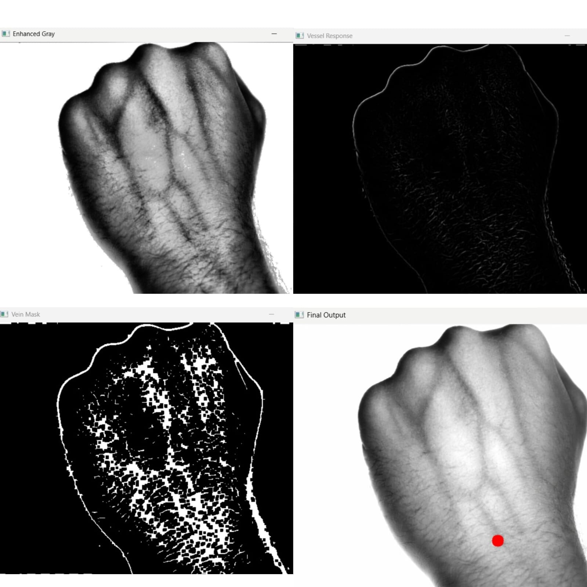
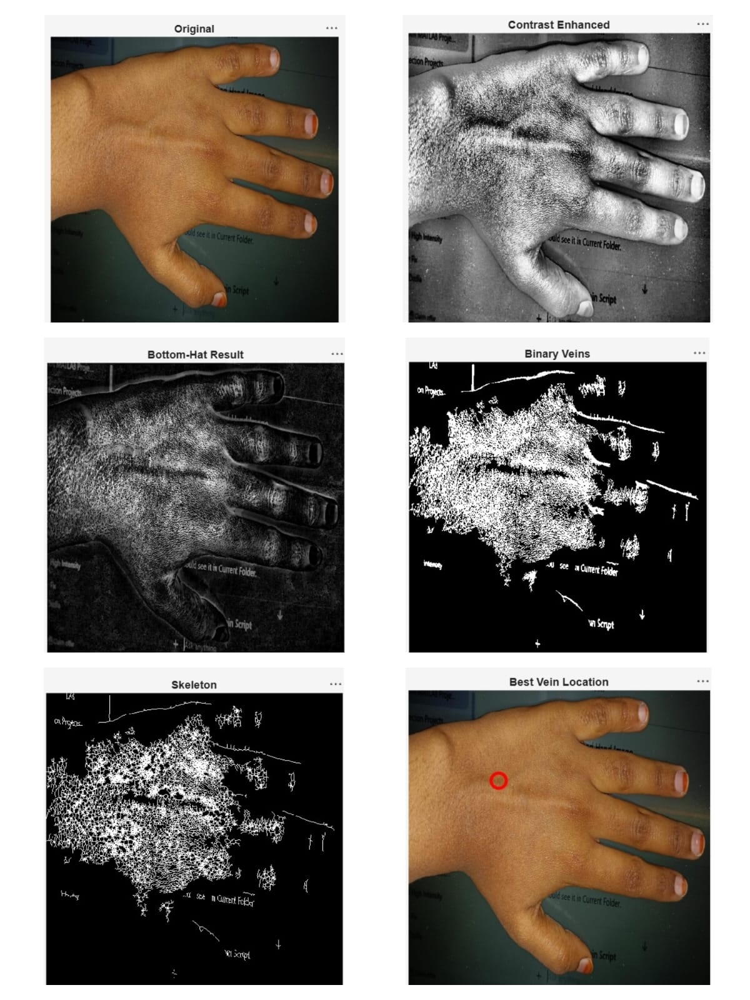

# Vein Guide with Auto Spot Marking using Image Processing

A computer vision and image processing system developed to identify suitable vein locations from hand images. The project uses MATLAB and Python-based image processing techniques to enhance vein visibility, extract vessel structures, and automatically identify an optimal vein location for venipuncture assistance.

---

## Project Overview

Vein visualization plays an important role in medical procedures such as blood collection, intravenous injections, and venipuncture. This project aims to improve vein visibility from hand images using image processing techniques and automatically localize a suitable vein point.

The project was implemented in:

* MATLAB for algorithm development and analysis
* Python for advanced vessel enhancement using Frangi vessel filtering

---

# Python Implementation Results

The Python implementation uses:

* Histogram Equalization
* CLAHE Enhancement
* Frangi Vessel Filtering
* Morphological Processing
* Contour Analysis
* Automatic Vein Localization



### Processing Stages

1. Enhanced Gray Image
2. Vessel Response Map
3. Vein Mask Generation
4. Final Vein Localization

### Observations

* Improved vein visibility
* Better suppression of background noise
* Cleaner vessel extraction
* Automatic localization of the dominant vein region

---

# MATLAB Implementation Results

The MATLAB implementation uses:

* CLAHE Contrast Enhancement
* Bottom-Hat Filtering
* Thresholding
* Skeletonization
* Distance Transform Analysis



### Processing Stages

1. Original Hand Image
2. Contrast Enhanced Image
3. Bottom-Hat Filtering
4. Binary Vein Extraction
5. Skeletonization
6. Best Vein Location Detection

### Observations

* Successful vein structure enhancement
* Extraction of candidate vein regions
* Automatic vein point localization
* Validation of the processing pipeline

---

# Methodology

```text
Input Hand Image
        ↓
Grayscale Conversion
        ↓
Contrast Enhancement
        ↓
Vein Enhancement
        ↓
Thresholding & Segmentation
        ↓
Vein Structure Extraction
        ↓
Best Vein Point Detection
        ↓
Final Vein Localization
```

---

# Technologies Used

## MATLAB

* MATLAB R2024a
* Image Processing Toolbox
* Morphological Operations
* Skeletonization
* Distance Transform

## Python

* Python 3.x
* OpenCV
* NumPy
* Scikit-Image
* Frangi Vessel Filter

---

# Repository Structure

```text
Vein-Guide-System
│
├── MATLAB
│   └── vein_detection.m
│
├── Python
│   └── vein_detection.py
│
├── Images
│   ├── matlab_results.png
│   └── python_results.png
│
└── README.md
```

---

# Applications

* Vein Visualization Systems
* Biomedical Image Processing
* Medical Imaging Research
* Computer Vision Applications
* Healthcare Assistance Systems

---

# Future Enhancements

* Near Infrared (NIR) Image Acquisition
* Real-Time Raspberry Pi Deployment
* Automatic Laser-Based Spot Marking
* Deep Learning-Based Vein Segmentation
* Clinical Dataset Validation

---

# Results Summary

| Implementation | Techniques Used                                                  | Outcome                                      |
| -------------- | ---------------------------------------------------------------- | -------------------------------------------- |
| MATLAB         | CLAHE, Bottom-Hat Filtering, Skeletonization, Distance Transform | Successful vein extraction and localization  |
| Python         | OpenCV, CLAHE, Frangi Vessel Filtering, Contour Analysis         | Improved vessel enhancement and localization |

---

# Conclusion

This project demonstrates the application of image processing techniques for vein detection and localization. The MATLAB implementation was used for algorithm development and validation, while the Python implementation provided improved vessel enhancement through Frangi filtering. The project establishes a foundation for future real-time embedded healthcare systems.

---

# Author

**Kavya Dodla**

B.tech in ECE

---

